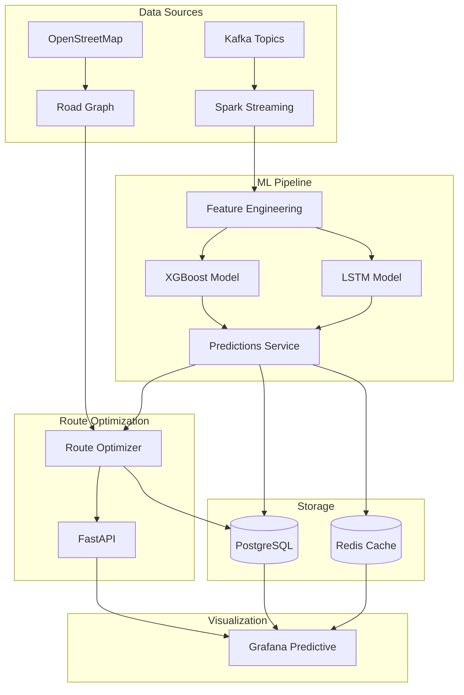

# 🚀 Plateforme Prédictive de Mobilité Urbaine - Abidjan

## Objectif
Créer une **seconde plateforme Grafana** dédiée aux prédictions de trafic et à l'optimisation d'itinéraires intelligents.

---

## Architecture Technique



---

## Composants à Développer

### 1️⃣ Base de Données - Nouvelles Tables

#### [NEW] [init_predictions.py](file:///C:/Users/HP/.gemini/antigravity/scratch/abidjan_smart_city/src/db/init_predictions.py)
Tables pour stocker les prédictions et itinéraires:
- `traffic_predictions` - Prédictions de vitesse/congestion
- `route_requests` - Demandes d'itinéraires
- `optimized_routes` - Itinéraires calculés
- `route_segments` - Segments des itinéraires
- `prediction_anomalies` - Anomalies futures détectées

---

### 2️⃣ Service de Prédiction ML

#### [NEW] [prediction_service.py](file:///C:/Users/HP/.gemini/antigravity/scratch/abidjan_smart_city/src/ml/prediction_service.py)
- Modèle XGBoost pour prédictions court terme (5-30 min)
- Modèle LSTM pour tendances long terme (30 min - 1h)
- Feature engineering (heure, jour, météo, historique)
- Anomaly detection pour anticiper incidents

---

### 3️⃣ Moteur d'Optimisation d'Itinéraires

#### [NEW] [route_optimizer.py](file:///C:/Users/HP/.gemini/antigravity/scratch/abidjan_smart_city/src/routing/route_optimizer.py)
- Graphe routier basé sur OpenStreetMap
- Algorithme A* avec coûts dynamiques
- Calcul d'itinéraires alternatifs
- Comparaison temps/distance/congestion

---

### 4️⃣ API Endpoints

#### [MODIFY] [main.py](file:///C:/Users/HP/.gemini/antigravity/scratch/abidjan_smart_city/src/api/main.py)
Nouveaux endpoints:
- `GET /predictions/{segment_id}` - Prédictions par segment
- `GET /predictions/all` - Toutes les prédictions
- `POST /routes/optimize` - Calculer itinéraire optimal
- `GET /routes/{route_id}` - Détails d'un itinéraire
- `GET /anomalies/predicted` - Anomalies anticipées

---

### 5️⃣ Dashboards Grafana

#### [NEW] [predictions_dashboard.json](file:///C:/Users/HP/.gemini/antigravity/scratch/abidjan_smart_city/grafana/dashboards/predictions_dashboard.json)
Panels:
1. **🔮 Prédictions de Vitesse** - Graphique temporel multi-segments
2. **🚦 Niveau de Congestion Futur** - Gauge avec prévision
3. **📈 Courbes de Tendance** - Évolution sur 1h
4. **⚠️ Anomalies Anticipées** - Table des risques
5. **🗺️ Carte Prédictive** - Heatmap dynamique

#### [NEW] [routes_dashboard.json](file:///C:/Users/HP/.gemini/antigravity/scratch/abidjan_smart_city/grafana/dashboards/routes_dashboard.json)
Panels:
1. **🗺️ Carte des Itinéraires** - Normal vs Optimisé
2. **⏱️ Comparaison Temps** - Barre comparative
3. **📊 Analyse des Segments** - Congestion par segment
4. **💡 Raisons du Choix** - Justification ML
5. **💰 Économies Estimées** - Temps, carburant, CO2

---

### 6️⃣ Simulateur de Prédictions

#### [NEW] [prediction_simulator.py](file:///C:/Users/HP/.gemini/antigravity/scratch/abidjan_smart_city/src/simulator/prediction_simulator.py)
Génère des prédictions réalistes pour démonstration

---

### 7️⃣ Carte de Planification Future

#### [NEW] [future_map.html](file:///C:/Users/HP/.gemini/antigravity/scratch/abidjan_smart_city/static/future_map.html)
- Interface Leaflet dédiée
- Formulaire de sélection (Origine, Destination, Date, Heure)
- Visualisation d'itinéraire futur
- Affichage des détails de prédiction

#### [MODIFY] [main.py](file:///C:/Users/HP/.gemini/antigravity/scratch/abidjan_smart_city/src/api/main.py)
- Endpoint `/future-map` pour servir la carte

---

### 8️⃣ Modèles ML Avancés (LSTM + Ensemble)

#### [NEW] [lstm_model.py](file:///C:/Users/HP/.gemini/antigravity/scratch/abidjan_smart_city/src/ml/lstm_model.py)
- Modèle LSTM pour prédictions long terme (>30 min)
- Séquence temporelle en entrée (historique récent)

#### [NEW] [ensemble_model.py](file:///C:/Users/HP/.gemini/antigravity/scratch/abidjan_smart_city/src/ml/ensemble_model.py)
- Combinaison pondérée : `0.7 * XGBoost + 0.3 * LSTM` (court terme)
- Combinaison pondérée : `0.3 * XGBoost + 0.7 * LSTM` (long terme)

#### [NEW] [ensemble_model.py](file:///C:/Users/HP/.gemini/antigravity/scratch/abidjan_smart_city/src/ml/ensemble_model.py)
- Combinaison pondérée : `0.7 * XGBoost + 0.3 * LSTM` (court terme)
- Combinaison pondérée : `0.3 * XGBoost + 0.7 * LSTM` (long terme)

### 9️⃣ Intégration OSRM (Routing Réaliste)

#### [MODIFY] [future_map.html](file:///C:/Users/HP/.gemini/antigravity/scratch/abidjan_smart_city/static/future_map.html)
- Remplacer le tracé "ligne droite" par `Leaflet Routing Machine`.
- Utiliser l'API OSRM publique (`router.project-osrm.org`) pour récupérer la géométrie exacte.
- Maintenir les waypoints définis par notre algorithme ML (pour forcer le passage par les segments optimisés) mais avec un tracé réaliste entre eux.

#### [MODIFY] [route_optimizer.py](file:///C:/Users/HP/.gemini/antigravity/scratch/abidjan_smart_city/src/routing/route_optimizer.py)
- Enrichir les objets `Edge` avec la géométrie réelle (Encoded Polyline).
- Permettre à l'API de renvoyer des coordonnées précises au lieu de simples points de début/fin.
### Tests Automatisés
```bash
# Vérifier les tables créées
docker-compose exec postgres psql -U admin -d smart_city -c "\dt"

# Tester les endpoints API
curl http://localhost:8000/predictions/all
curl -X POST http://localhost:8000/routes/optimize -d '{"origin":"SEG001","destination":"SEG008"}'

# Vérifier les dashboards Grafana
curl http://localhost:3000/api/dashboards/uid/predictions-dashboard
```

### Vérification Manuelle
- Dashboard Prédictions: http://localhost:3000/d/predictions-dashboard
- Dashboard Itinéraires: http://localhost:3000/d/routes-dashboard
- API Documentation: http://localhost:8000/docs

---

## Ordre d'Implémentation

1. ✅ Créer tables PostgreSQL pour prédictions/routes
2. ✅ Implémenter service de prédiction ML
3. ✅ Implémenter moteur d'optimisation de routes
4. ✅ Ajouter endpoints API
5. ✅ Créer dashboard Grafana Prédictions
6. ✅ Créer dashboard Grafana Itinéraires
7. ✅ Implémenter simulateur de données
8. ✅ Tests et validation

### 🔟 Big Data Scaling (Cassandra)

#### [MODIFY] [docker-compose.yml](file:///C:/Users/HP/.gemini/antigravity/scratch/abidjan_smart_city/docker-compose.yml)
- Ajouter le service `cassandra` (image: `cassandra:4.1`).
- Exposer le port `9042`.

#### [NEW] [src/db/cassandra_db.py](file:///C:/Users/HP/.gemini/antigravity/scratch/abidjan_smart_city/src/db/cassandra_db.py)
- Classe `CassandraConnector`.
- Initialisation du Keyspace `smart_city`.
- Table `traffic_data` partitionnée par `segment_id` et clusterisée par `timestamp` (pour des lectures rapides par segment).

#### [MODIFY] [src/spark/traffic_streaming.py](file:///C:/Users/HP/.gemini/antigravity/scratch/abidjan_smart_city/src/spark/traffic_streaming.py)
- Dans `process_batch`, ajouter l'écriture vers Cassandra.
- Utiliser `cassandra-driver` pour l'insertion par batch (`BatchStatement`).

#### [MODIFY] [src/producers/traffic_producer.py](file:///C:/Users/HP/.gemini/antigravity/scratch/abidjan_smart_city/src/producers/traffic_producer.py)
- Augmenter `num_vehicles` à 5000.

### 1️⃣1️⃣ ML Improvement: Weather Integration

#### [MODIFY] [src/spark/traffic_streaming.py](file:///C:/Users/HP/.gemini/antigravity/scratch/abidjan_smart_city/src/spark/traffic_streaming.py)
- Ajouter la consommation du topic `weather_data`.
- Stocker les données météo dans PostgreSQL (`weather_data`).

#### [MODIFY] [src/ml/prediction_service.py](file:///C:/Users/HP/.gemini/antigravity/scratch/abidjan_smart_city/src/ml/prediction_service.py)
- Joindre les données de trafic avec les données météo (sur `timestamp` arrondi).

#### [MODIFY] [src/ml/feature_engineering.py](file:///C:/Users/HP/.gemini/antigravity/scratch/abidjan_smart_city/src/ml/feature_engineering.py)
- Ajouter `precipitation` et `temperature` comme features.


