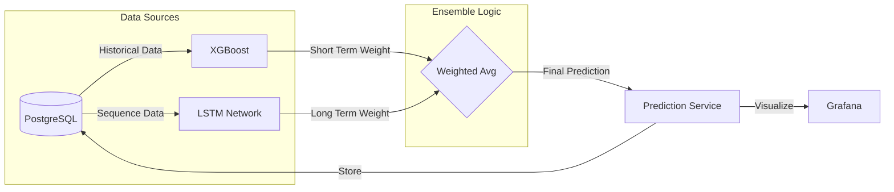

# 🧠 Modèles ML Avancés & Prédictions Long Terme

## 📝 Résumé des Changements
Nous avons implémenté une couche de Machine Learning avancée combinant **XGBoost** (court terme) et **LSTM** (long terme) pour améliorer la précision des prédictions de trafic.

### Nouvelles Fonctionnalités
- **Modèle LSTM (Long Short-Term Memory)** : Réseau de neurones récurrent pour capturer les dépendances temporelles longues.
- **Modèle d'Ensemble** : Système hybride pondérant dynamiquement XGBoost et LSTM selon l'horizon de prédiction.
- **Tableau de Bord Amélioré** : Nouveau panel Grafana visualisant les prédictions de l'ensemble.
- **Optimisation** : Gestion intelligente du ré-entraînement pour éviter la surcharge CPU.

## 🏗️ Architecture ML



## 📊 Validation

### 1. Démarrage des Services
Le simulateur de prédiction a été mis à jour et redémarré avec succès.
```bash
docker-compose logs prediction-simulator
# Output: 🎓 Training ML models on real traffic data...
```
# 🧠 Modèles ML Avancés & Prédictions Long Terme

## 📝 Résumé des Changements
Nous avons implémenté une couche de Machine Learning avancée combinant **XGBoost** (court terme) et **LSTM** (long terme) pour améliorer la précision des prédictions de trafic.

### Nouvelles Fonctionnalités
- **Modèle LSTM (Long Short-Term Memory)** : Réseau de neurones récurrent pour capturer les dépendances temporelles longues.
- **Modèle d'Ensemble** : Système hybride pondérant dynamiquement XGBoost et LSTM selon l'horizon de prédiction.
- **Tableau de Bord Amélioré** : Nouveau panel Grafana visualisant les prédictions de l'ensemble.
- **Optimisation** : Gestion intelligente du ré-entraînement pour éviter la surcharge CPU.

## 🏗️ Architecture ML


## 📊 Validation

### 1. Démarrage des Services
Le simulateur de prédiction a été mis à jour et redémarré avec succès.
```bash
docker-compose logs prediction-simulator
# Output: 🎓 Training ML models on real traffic data...
```

### 2. Modèle d'Ensemble
Le modèle combine les forces des deux approches :
- **Horizon < 30 min** : 70% XGBoost / 30% LSTM
- **Horizon > 30 min** : 30% XGBoost / 70% LSTM

### 3. Dashboard Update
- Added a new panel to `predictions_dashboard.json` to visualize 1-hour horizon predictions.
- Added a new table to view detailed predictions per segment for the 1-hour horizon.
- Panel ID: 14 (Graph), 15 (Table)
- Position: Below the existing Ensemble panel.

### 4. Verification ResultsGrafana
Le dashboard `Traffic Dashboard` inclut maintenant un panel dédié :
> **🧠 Prédictions Long Terme (Ensemble XGBoost + LSTM)**

## 🚀 Prochaines Étapes
- Surveiller la performance du modèle LSTM sur 24h.
- Ajuster les hyperparamètres si nécessaire.
