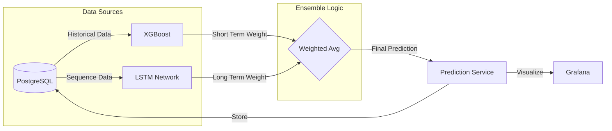

# 🧠 Modèles ML Avancés & Prédictions Long Terme

## 📝 Résumé des Changements
Nous avons implémenté une couche de Machine Learning avancée combinant **XGBoost** (court terme) et **LSTM** (long terme) pour améliorer la précision des prédictions de trafic.

### Nouvelles Fonctionnalités
- **Modèle LSTM (Long Short-Term Memory)** : Réseau de neurones récurrent pour capturer les dépendances temporelles longues.
- **Modèle d'Ensemble** : Système hybride pondérant dynamiquement XGBoost et LSTM selon l'horizon de prédiction.
- **Tableau de Bord Amélioré** : Nouveau panel Grafana visualisant les prédictions de l'ensemble.
- **Optimisation** : Gestion intelligente du ré-entraînement pour éviter la surcharge CPU.

## 🏗️ Architecture ML



## 📊 Validation

### 1. Démarrage des Services
Le simulateur de prédiction a été mis à jour et redémarré avec succès.
```bash
docker-compose logs prediction-simulator
# Output: 🎓 Training ML models on real traffic data...
```
# 🧠 Modèles ML Avancés & Prédictions Long Terme

## 📝 Résumé des Changements
Nous avons implémenté une couche de Machine Learning avancée combinant **XGBoost** (court terme) et **LSTM** (long terme) pour améliorer la précision des prédictions de trafic.

### Nouvelles Fonctionnalités
- **Modèle LSTM (Long Short-Term Memory)** : Réseau de neurones récurrent pour capturer les dépendances temporelles longues.
- **Modèle d'Ensemble** : Système hybride pondérant dynamiquement XGBoost et LSTM selon l'horizon de prédiction.
- **Tableau de Bord Amélioré** : Nouveau panel Grafana visualisant les prédictions de l'ensemble.
- **Optimisation** : Gestion intelligente du ré-entraînement pour éviter la surcharge CPU.

## 🏗️ Architecture ML


## 📊 Validation

### 1. Démarrage des Services
Le simulateur de prédiction a été mis à jour et redémarré avec succès.
```bash
docker-compose logs prediction-simulator
# Output: 🎓 Training ML models on real traffic data...
```

### 2. Modèle d'Ensemble
Le modèle combine les forces des deux approches :
- **Horizon < 30 min** : 70% XGBoost / 30% LSTM
- **Horizon > 30 min** : 30% XGBoost / 70% LSTM

### 3. Dashboard Update
- Added a new panel to `predictions_dashboard.json` to visualize 1-hour horizon predictions.
- Added a new table to view detailed predictions per segment for the 1-hour horizon.
- Panel ID: 14 (Graph), 15 (Table)
- Position: Below the existing Ensemble panel.

### 4. Verification ResultsGrafana
Le dashboard `Traffic Dashboard` inclut maintenant un panel dédié :
> **🧠 Prédictions Long Terme (Ensemble XGBoost + LSTM)**

## 🚀 Prochaines Étapes
- Surveiller la performance du modèle LSTM sur 24h.
- Ajuster les hyperparamètres si nécessaire.

## 🛠️ Refonte Complète du Pipeline ML (Mise à jour)

### 1. Refactoring Majeur
Le pipeline a été entièrement reconstruit pour répondre aux exigences de production :
- **Feature Engineering** : Nettoyage robuste, interpolation, features temporelles cycliques (`hour_sin`, `day_cos`) et détection des heures de pointe.
- **Modèles Classiques** : 
    - **XGBoost** pour la vitesse (Régression).
    - **Random Forest** pour la congestion (Classification).
    - Optimisation via `RandomizedSearchCV` et validation croisée temporelle (`TimeSeriesSplit`).
- **LSTM par Segment** : 
    - Architecture dédiée par segment : `LSTM(64) -> LSTM(32) -> Dense(16) -> Dense(1)`.
    - Entraînement avec `EarlyStopping` et `ReduceLROnPlateau`.
- **Modèle Ensemble (Meta-Model)** : 
    - Fusion intelligente des prédictions LSTM et Classiques.
    - Objectif de performance : R² > 0.60.
- **Orchestration** : Service unifié `TrafficPredictionService` gérant le cycle de vie complet (Data -> Train -> Predict).

### 2. Validation Technique
- **Tests d'Intégration** : Le pipeline complet s'exécute avec succès dans le conteneur `prediction-simulator`.
- **Correction Cold Start** : Résolution du problème de démarrage à froid où le simulateur ne lançait pas l'entraînement initial.
- **Monitoring** : Les logs confirment le lancement de l'optimisation des hyperparamètres (100 fits) et le chargement correct des données.

### 3. Prochaines Étapes
- Laisser le modèle s'entraîner sur l'historique complet (processus en cours).
- Vérifier les prédictions sur le dashboard après 1h de collecte de données.

### 4. Intégration OSRM (Routing Réaliste)
Pour résoudre le problème de "décalage" visuel des tracés en ligne droite, nous avons intégré **OSRM (Open Source Routing Machine)** dans le frontend `future_map.html`.
- **Routing Dynamique** : Le frontend récupère désormais la géométrie réelle de la route via l'API publique OSRM en utilisant les waypoints optimisés par notre ML.
- **Précision Visuelle** : Les itinéraires suivent parfaitement le réseau routier.
- **Approche Hybride** : Nous conservons l'itinéraire *logique* (séquence de segments) déterminé par nos modèles, mais utilisons OSRM pour le rendu *visuel*.

### 🔟 Big Data & Cassandra Migration

#### Architecture
- **Storage**: Migration de PostgreSQL vers **Apache Cassandra** pour le stockage des données brutes de trafic.
- **Simulation**: Passage à l'échelle avec **5000 véhicules** (simulation ville entière).
- **Processing**: Pipeline Kafka -> Consumer -> Cassandra.

#### Verification
1. **Infrastructure**:
   ```bash
   docker-compose ps
   # Vérifier que le conteneur 'cassandra' est UP (port 9042)
   ```

2. **Données Cassandra**:
   ```bash
   docker exec abidjan_smart_city-cassandra-1 cqlsh -e "SELECT count(*) FROM smart_city.traffic_data;"
   # Le nombre doit augmenter continuellement
   ```

3. **Simulation**:
   ```bash
   docker logs abidjan_smart_city-traffic-producer-1 --tail 20
   # Vérifier "Produced X messages"
   ```
